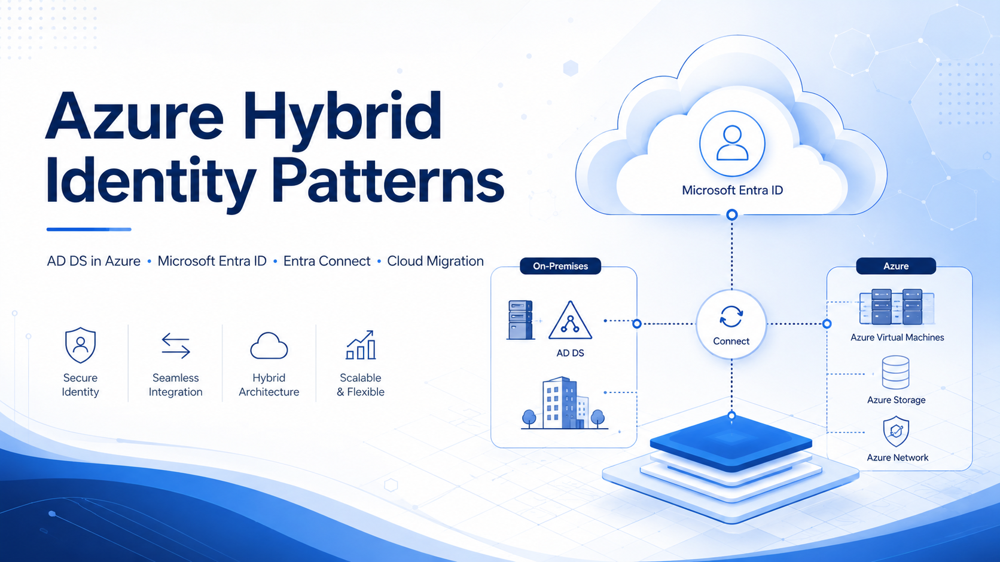

# Azure Hybrid Identity Patterns

Practical architecture notes for hybrid identity scenarios involving AD DS, Microsoft Entra ID, Entra Connect, Azure-hosted workloads, and cloud migration decision-making.

> This repository is not a step-by-step deployment guide.  
> It is a collection of architecture patterns, decision points, and migration considerations.


<p align="center">
  
</p>

---

## Why this repository exists

Many Azure migration discussions are not only about moving virtual machines.
They are about understanding identity, DNS, authentication flows, legacy dependencies, and the target operating model.

This repo summarizes common patterns for deciding when to:

- keep workloads cloud-native with Microsoft Entra ID
- extend AD DS into Azure with domain controllers on Azure VMs
- keep AD DS on-prem and connect through VPN/ExpressRoute
- use Entra Connect in staging mode for migration or disaster recovery
- gradually reduce AD DS dependencies over time

---

---

## High-level decision question

Before choosing a pattern, clarify the target state:

```text
Are we preserving AD-dependent workloads in Azure,
or are we trying to modernize away from AD DS dependencies?
```

---

## Patterns

> Scores reflect **long-term steady state**. Patterns marked `Bridge` or `Transitional` are intentionally temporary — their value is enabling the next step, not being the destination. Capex/Opex and tooling maturity considerations are covered in [Migration Paths](./docs/migration-paths.md).

### Infrastructure Patterns

| # | Pattern | Description | 🔒 Sec | ⚡ Innov | 🤖 Auto | 🧠 AI | 🏭 Ops | 🔄 Migration fit | ⏱️ Longevity | Doc |
|---|---------|-------------|--------|----------|---------|-------|--------|-----------------|-------------|-----|
| P1 | Cloud-native + on-prem integration | Entra ID primary, PaaS-first, minimal AD dependency | ●●●●● | ●●●●● | ●●●●● | ●●●●● | ●●●●● | ●●○○○ | `Permanent` | [→](./patterns/p01-cloud-native.md) |
| P2 | AD DS extended into Azure | DC VMs in Azure for legacy / AD-dependent workloads (NPS, Kerberos, RADIUS) | ●●●○○ | ●●○○○ | ●●●○○ | ●●○○○ | ●●○○○ | ●●●●● | `Bridge` | [→](./patterns/p02-adds-in-azure.md) |
| P3 | Azure as second datacenter | Classic infra in Azure for DR/BCP or lift-and-shift, AD on-prem authoritative | ●●○○○ | ●○○○○ | ●●○○○ | ●○○○○ | ●●○○○ | ●●●●○ | `Bridge` | [→](./patterns/p03-azure-second-dc.md) |
| P4 | Entra Connect migration + staging mode | Sync engine migration, DR standby, Cloud Sync adoption | ●●●○○ | ●●●○○ | ●●●●○ | ●●●○○ | ●●●○○ | ●●●●● | `Transitional` | [→](./patterns/p04-entra-connect-migration.md) |
| P5 | Entra-native modernization | Reduce LDAP / Kerberos / NTLM / GPO dependencies progressively | ●●●●● | ●●●●● | ●●●●○ | ●●●●● | ●●●○○ | ●●●●● | `Transitional` | [→](./patterns/p05-entra-native-modernization.md) |
| P6 | AD DS retirement path | Full decommission of on-prem AD — Entra ID only target state | ●●●●● | ●●●●● | ●●●●● | ●●●●● | ●●●●● | ●○○○○ | `Permanent` | [→](./patterns/p06-adds-retirement.md) |

### Identity Service Patterns

| # | Pattern | Description | 🔒 Sec | ⚡ Innov | 🤖 Auto | 🧠 AI | 🏭 Ops | 🔄 Migration fit | ⏱️ Longevity | Doc |
|---|---------|-------------|--------|----------|---------|-------|--------|-----------------|-------------|-----|
| P7 | Entra ID as primary IdP (ADFS replacement) | Decommission ADFS, migrate federated apps to Entra ID | ●●●●● | ●●●●● | ●●●●○ | ●●●●● | ●●●●● | ●●●●○ | `Permanent` | [→](./patterns/p07-entra-primary-idp.md) |
| P8 | Privileged access / tiering (PAW/ESAE → PIM) | Hybrid admin tiering with Entra PIM, JIT, PAW | ●●●●● | ●●●○○ | ●●●●○ | ●●●○○ | ●●○○○ | ●●●○○ | `Permanent` | [→](./patterns/p08-privileged-access-tiering.md) |
| P9 | B2B / external identity federation | Entra External ID for partner, vendor, contractor access | ●●●●● | ●●●●● | ●●●●● | ●●●●○ | ●●●●● | ●●○○○ | `Permanent` | [→](./patterns/p09-b2b-external-federation.md) |
| P10 | Entra Domain Services as AD DS drop-in | Managed Kerberos / LDAP in Azure without DC VMs | ●●●●○ | ●●●○○ | ●●●○○ | ●●○○○ | ●●●●○ | ●●●●○ | `Bridge` | [→](./patterns/p10-entra-domain-services.md) |
| P11 | Device identity transition (Hybrid → Entra Join) | Move endpoints from Hybrid AAD Join to pure Entra Join | ●●●●● | ●●●●● | ●●●●● | ●●●●● | ●●●●● | ●●●●● | `Transitional` | [→](./patterns/p11-device-identity-transition.md) |
| P12 | Passwordless / MFA rollout in hybrid | FIDO2, WHfB, Authenticator in mixed AD + Entra environments | ●●●●● | ●●●●● | ●●●●○ | ●●●●● | ●●●○○ | ●●●●● | `Permanent` | [→](./patterns/p12-passwordless-mfa-rollout.md) |

---

> **Score legend**
> 🔒 Security posture · ⚡ Innovation readiness · 🤖 Automation grade · 🧠 AI integration · 🏭 Ops complexity · 🔄 Migration fit as stepping stone
> ● = high/good · ○ = low/poor
>
> **Longevity**
> `Permanent` — valid long-term target state · `Transitional` — active modernization phase, expected to evolve · `Bridge` — intentionally temporary, plan your exit upfront

---

## Decision Tree 
